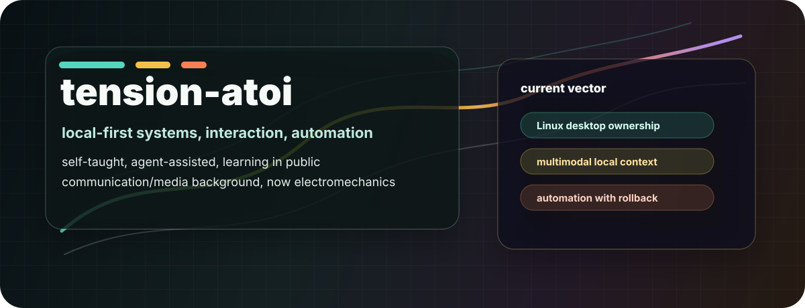
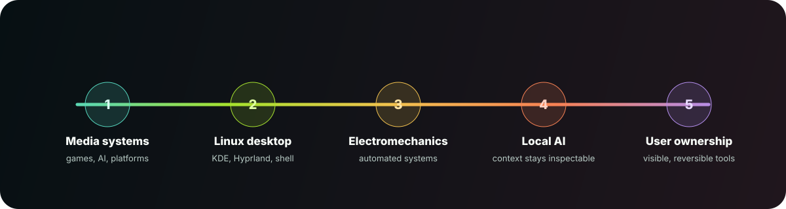

# Salut, je suis tension-atoi 👋

Bienvenue sur mon profil GitHub — je découvre, j'apprends et je construis petit à petit.

- 🔭 Actuellement : exploration de projets open‑source et apprentissage continu
- 🌱 J'apprends : Python, TypeScript, bonnes pratiques CI/CD
- 💬 Discuter de : automatisation, développement web, DevOps
- 📫 Contact : via GitHub (https://github.com/tension-atoi)

---

  

# Hi, I am tension-atoi

I am building my way into systems work from a messy but useful intersection: communication, digital media, videogames, AI, platform criticism, Linux desktops, and now electromechanics for automated[...]

I am self-taught in software. I use agents heavily. That is not a claim that generated code is automatically good. It is a commitment to turn exploration into things that can be inspected, correcte[...]

## What I Care About

- **Local-first computing.** Hardware that sits on my desk should not be treated as a passive terminal for someone else's platform.
- **Readable automation.** Tools should say what they are doing, what they touched, and how to roll back.
- **Interfaces with agency.** A desktop should feel alive without taking control away from the user.
- **Learning in public.** I am not pretending to already know everything. I am building, breaking, reading, asking, and tightening the rails as I go.

## Current Direction

  

The main idea I am pursuing is GNU.IN OS: an experimental local-first desktop runtime for Linux/Hyprland, covering shell surfaces, local context, and bounded agentic automation.

It is not a finished product yet. It is a research-product: useful to me now, serious enough to deserve engineering discipline, and still early enough that public claims need to be careful.

## How I Use AI

AI helps me:

- inspect unfamiliar code;
- summarize logs and system state;
- draft patches;
- compare options;
- write documentation;
- learn faster without pretending the learning is complete.

AI should not be final authority over:

- secrets;
- shell execution;
- live runtime mutation;
- public release claims;
- destructive actions;
- security-sensitive decisions.

The rule I am trying to live by is simple: automation should make work more visible, not less.

## Background

- Studied communication and digital media, with attention to videogames, AI, and large platform companies.
- Now studying electromechanics for automated systems.
- First tried Ubuntu in 2014, got frustrated, kept coming back anyway.
- Moved from Windows to CachyOS/KDE, then into Hyprland after exploring Caelestia Shell and Illogical Impulse.
- Started building because the desktop I wanted did not quite exist.

## Public Surfaces

- Organization: [gnu-in-labs](https://github.com/gnu-in-labs)
- Public site: [gnu6.live](https://gnu6.live)

Some repositories are intentionally private while public-readiness, licensing, documentation, and safety boundaries are being worked out.

## Feedback

Concrete correction is welcome.

Useful feedback sounds like:

- "This claim is too strong."
- "This boundary is unsafe."
- "This needs a test."
- "This wording is not accessible."
- "This idea is good, but the implementation path is risky."

I will gladly read and consider comments that make the work clearer, safer, or more honest.
